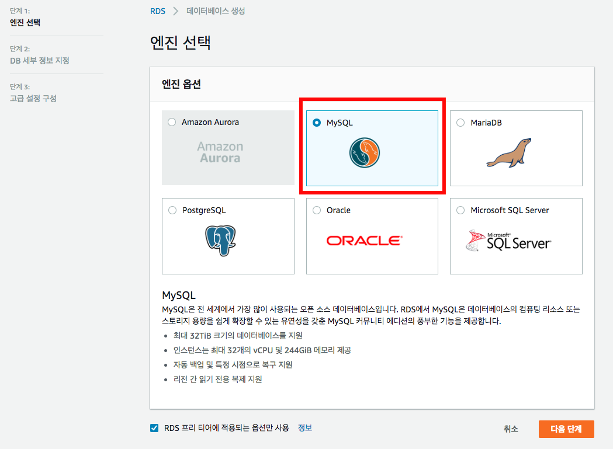
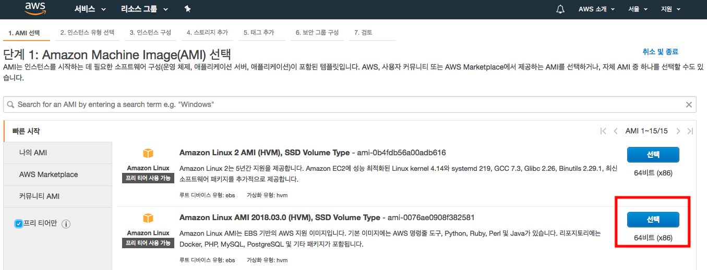
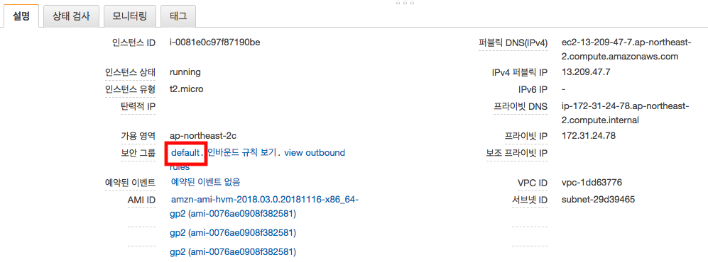
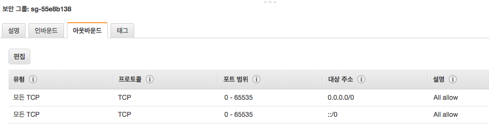
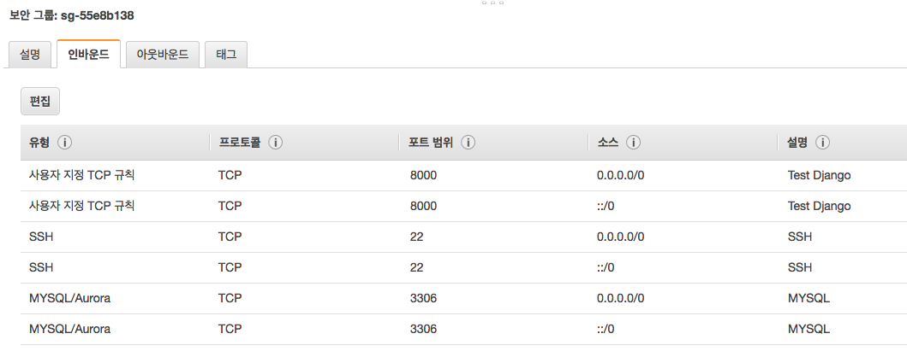

# RDS 설치 (MySQL)
https://ap-northeast-2.console.aws.amazon.com/rds/home?region=ap-northeast-2#launch-dbinstance:



마스터 암호는 수업에 사용 하므로 쉽게 설정해주세요. 예) qwer1234

VPC 보안 그룹은 “기존 VPC 보안 그룹 사용”(defaul) 선택해주세요.


# Linux Instance 설치
https://ap-northeast-2.console.aws.amazon.com/ec2/v2/home?region=ap-northeast-2#LaunchInstanceWizard:



2번째인: Amazon Linux AMI 2018.03.0 (HVM), SSD Volume Type 선택 해주세요.

보안 그룹을 “기존 보안 그룹 선택” 선택 해주세요.


# 보안 그룹 설정



보안 그룹에 default 선택 합니다.

수업에 사용 하므로 아웃바운드는 모두 열고 인바운드는 22, 3306, 8000 포트를 열어야 합니다.





이제 Mac에서 telnet으로 MySQL과 Linux에 접속 해봅니다.
```sh
telnet <RDS 엔드포인트> 3306
telnet <Linux Instance 퍼블릭 DNS(IPv4)> 22
telnet <Linux Instance 퍼블릭 DNS(IPv4)> 8000
```

연결이 된다면 설정 완료 입니다.

# GitLab.com
https://gitlab.com

수업에 사용할 git repository를 무료로 제공 해주는 사이트 입니다.

가입 하시고 이메일 인증 받으시면 됩니다.

비밀번호는 수업에 사용하므로 쉡게 설정해주세요. 예) qwer1234
